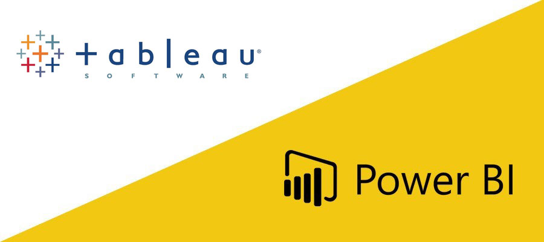

-

### Hi there, I'm Bibhuti Bhusan Sahoo👋
	
<h2>  📞 CONNECT WITH ME </h2>
  
 

	
	
	
	
	 
     

## I'm a Software Engineer , Data Scientist & Blogger  

    
  ---

  <!-- * 🔭 I am Currently working as **Sr.Data Scientist** at [Cygnet 🦢](https://cygnet-infotech.com/) -->

- 🌱 I’m currently Learning Data Science & NLP😎.
  
- 👯 I’m working on keras, tensorflow  models and looking for  collaboration with anyone.
  
- 🥅 2021 Goals: Explore the more and more research of Computer vision, Deep learning, NLP, Time Series Analysis etc.

- ⚡ Fun fact: I love to code.
  
    

## ⚡  Technologies I use

     

    

        <table align="center">
            <tr>
                <td align="center" width="140" height="112.43">
                    
                      Python
                </td>
                <td align="center" width="140" height="112.43">
                    
                      Jupyter
                </td>
                <td align="center" width="140" height="112.43">
                    
                      TensorFlow
                </td>
                <td align="center" width="140" height="112.43">
                    
                      Scikit Learn
                </td>
                <td align="center" width="140" height="112.43">
                    
                      Docker
                </td>
                <td align="center" width="140" height="112.43">
                    
                      Odoo
                </td>
                <td align="center" width="140" height="112.43">
                    
                      MY SQL
                </td>
                <td align="center" width="140" height="112.43">
                    
                      HTML & CSS
                </td>
                <td align="center" width="140" height="112.43">
                    
                     Power BI
                </td>
            </tr>
        </table>
    

     

---

## Hope you find some valuable information

(<https://bibhutiport.blogspot.com/>)

---

***Thanks for visit my profile.***
