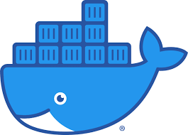

- ### Hi there, I'm Bibhuti Bhusan Sahoo👋
    

  
  

  

  

  ## I'm a Software Engineer , Data Scientist & Blogger  
    
  ---

  <!-- * 🔭 I am Currently working as **Sr.Data Scientist** at [Cygnet 🦢](https://cygnet-infotech.com/) -->

  - 🌱 I’m currently Learning Data Science & NLP😎.
  
  - 👯 I’m collaborator in keras, tensorflow and looking for more collaboration.
  
  - 🥅 2021 Goals: Explore the more and more research of Computer vision, Deep learning, NLP, Time Series Analysis etc.

  - ⚡ Fun fact: I love to code.
  
    
    
      
    
    ## ⚡  Technologies I use 
    
     
    
    

        <table align="center">
            <tr>
                <td align="center" width="140" height="112.43">
                    
                      Python
                </td>
                <td align="center" width="140" height="112.43">
                    
                      Jupyter
                </td>
                <td align="center" width="140" height="112.43">
                    
                      TensorFlow
                </td>
                <td align="center" width="140" height="112.43">
                    
                      Scikit Learn
                </td>               
                <td align="center" width="140" height="112.43">
                    
                      Docker
                </td>
                <td align="center" width="140" height="112.43">
                    
                      Odoo
                </td>
                <td align="center" width="140" height="112.43">
                    
                      HTML & CSS
                </td>
            </tr>
        </table>
    

     

---
## Hope you find some valuable information

<!-- 💾 365 Days of Computer Vision - [🔗](https://github.com/ashishpatel26/365-Days-Computer-Vision-Learning-Linkedin-Post) -->

---

***Thanks for visit my profile.***
